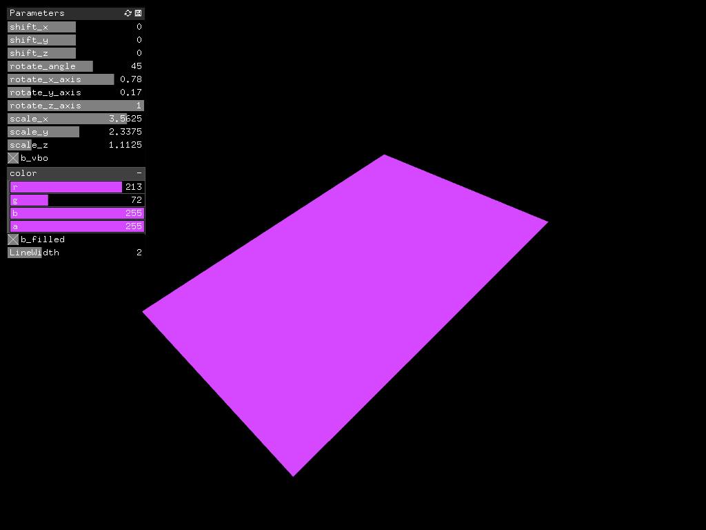

#study__ManualCoordinateTransformation

##環境
*	OS X El Capitan(10.11.6)
*	Xcode : 7.2
*	oF : 0.9.0

##add on
ofxGui  
ofxXmlSettings

##Contents
Manualでの座標変換.  
ofVboを使用して描画を高速化したい場合、ofTranslate()などで「座標変換して描画」と言う手順を取れず、
単に座標値をvbo_Verts[]に格納し、一発でGPUに渡すこととなる。
この時、vbo_Verts[]に格納する値は、originalの座標系での値を格納する必要があるので、
これを実現するために、manualでの座標変換が必要である。

##note

